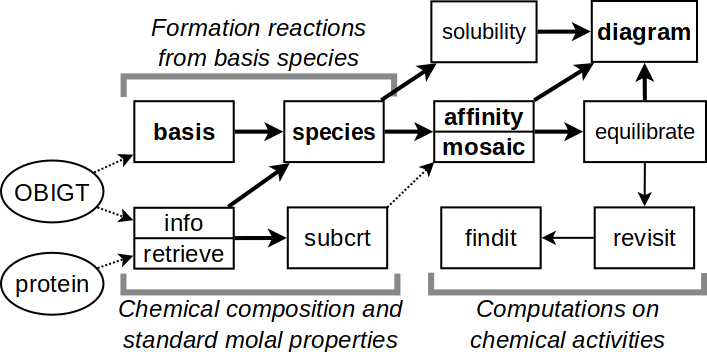

```{r options, include=FALSE}
options(width = 80)
options(digits = 6)
```

```{r setup, include=FALSE}
library(knitr)
# invalidate cache when the tufte version changes
opts_chunk$set(tidy = FALSE, cache.extra = packageVersion('tufte'))
options(htmltools.dir.version = FALSE)
knit_hooks$set(small.mar = function(before, options, envir) {
    if (before) par(mar = c(4.2, 4.2, .1, .1))  # smaller margin on top and right
})
knit_hooks$set(tiny.mar = function(before, options, envir) {
    if (before) par(mar = c(.1, .1, .1, .1))  # tiny margin all around
})
knit_hooks$set(smallish.mar = function(before, options, envir) {
    if (before) par(mar = c(4.2, 4.2, 0.9, 0.9))  # smallish margins on top and right
})
# dpi setting
dpi <- 72
# use pngquant to optimize PNG images
knit_hooks$set(pngquant = hook_pngquant)
# pngquant isn't available on R-Forge ...
if (!nzchar(Sys.which("pngquant"))) pngquant <- NULL else pngquant <- "--speed=1 --quality=0-50"
# some frequently used HTML expressions
logfO2 <- "log<i>f</i><sub>O<sub>2</sub></sub>"
# use lowercase here because these tend to be variable names in the examples
zc <- "<i>Z</i><sub>C</sub>"
o2 <- "O<sub>2</sub>"
h2o <- "H<sub>2</sub>O"
# http://stackoverflow.com/questions/23852753/knitr-with-gridsvg
# Set up a chunk hook for manually saved plots.
knit_hooks$set(custom.plot = hook_plot_custom)
# hook to change  to <embed /> -- required for interactive SVG
hook_plot <- knit_hooks$get("plot")
knit_hooks$set(plot = function(x, options) {
  x <- hook_plot(x, options)
  if (!is.null(options$embed.tag) && options$embed.tag) x <- gsub("`help.start()`</span> to browse the R help documents, then choose "Packages" followed by "CHNOSZ".
That shows an index of the manual (help page) for each function; many of the help pages include examples.
There are also links to the *demos* (longer examples) and *vignettes* (more in-depth documentation).
Suggestions for accessing the documentation are indicated here with <span style="color:blue">blue text</span>.
For example, read <span style="color:blue">`?"CHNOSZ-package"`</span> to get an overview of the package and a list of features.
```{marginfigure}
That page identifies some features as experimental, i.e. not based on published algorithms or extensively compared with published results.
```

## Organization of major functions

CHNOSZ is made up of a set of functions and supporting datasets.
The major components of the package are shown in the figure below, which is an updated version of the flowchart from @Dic08.
Rectangles and ellipses represent functions and datasets; bold text indicates primary functions.



Many functions in CHNOSZ have no side effects.
That is, the function only returns a result; to use the result elsewhere, it can be assigned to a variable with `<-`.
In this document (but not in the code chunks), the names of these functions are set in <span style="color:green">green text</span>.
```{marginfigure}
When they are mentioned, names of functions in the base and recommended packages of R are said to belong to R. Example: Use R's `plot()` to plot the points.
```
Major functions without side effects in CHNOSZ are:

* <span style="color:green">`info()`</span>: search for species in the thermodynamic database
* <span style="color:green">`subcrt()`</span>: calculate the thermodynamic properties of species and reactions
* <span style="color:green">`affinity()`</span>: calculate the affinities of formation reactions using given chemical activities
* <span style="color:green">`equilibrate()`</span>: calculate the equilibrium chemical activities of the species of interest
* <span style="color:green">`diagram()`</span>: plot the results

Some functions in CHNOSZ do have side effects: they modify the `thermo` data object in the current R session.
In this document, the names of these functions are set in <span style="color:red">red text</span>.
The major functions with side effects are:

* <span style="color:red">`basis()`</span>: set the basis species and their chemical activities
* <span style="color:red">`species()`</span>: set the species of interest and their (non-equilibrium) chemical activities
* <span style="color:red">`data(thermo)`</span>: reset the database, restoring all settings to their default values.

The following pseudocode shows a common sequence of commands.
In actual usage, the `...` are replaced by arguments that define the chemical makeup and range of conditions of the system:
```{r, eval=FALSE}
basis(...)
species(...)
a <- affinity(...)
e <- equilibrate(a)  ## optional
diagram(e)           ## or diagram(a)
data(thermo)         ## clear system settings
```

Some experimental functions are available:

* (**experimental**) using <span style="color:green">`revisit()`</span> to calculate/plot summary statistics of the chemical activities of the species of interest and <span style="color:green">`findit()`</span> to search for combinations of activities of basis species, temperature and/or pressure that optimize those statistics.

# Thermodynamic database and chemical formulas

While an attempt has been made to provide a primary database (`OBIGT.csv`) that is generally internally consistent, all thermodynamic data, calculations, and examples are provided *as is*.
```{marginfigure}
For crucial problems, check not only the accuracy of the database, but also the *suitability of the data* for your problem.
If there is any doubt about the suitability of data, please consult the primary sources (see  <span style="color:blue">?`browse.refs`</span>).
```
Where possible, data with known or suspected inconsistencies have been placed into a secondary database (`OBIGT-2.csv`) that should be regarded as experimental.

## The <span style="color:green">`info()`</span> function

<span style="color:green">`info()`</span> provides an interface to the thermodynamic database packaged with CHNOSZ.
Suppose you are interested in the thermodynamic properties aqueous ethylene.
You can search for the species by name:
```{r info_ethylene}
info("ethylene")
```

Multiple entries exist for ethylene; the index of the `aq` (aqueous) species is returned by default.
A second argument can be used to specify a different physical state:
```{r info_ethylene_gas}
info("ethylene", "gas")
```

Knowing that aqueous ethylene is species number 88 in the database, you can again use <span style="color:green">`info()`</span> to retrieve the set of standard molal thermodynamic properties and equations of state parameters:
```{r info_88}
info(88)
```

This number can be used as an argument (`ispecies`) for other functions in CHNOSZ to uniquely identify any species; some commonly used functions also accept the species names.
Liquid water is species number 1; it has NA entries in the database because specialized functions are used to compute its properties:
```{r info_info_water}
info(info("water"))
```

## Fuzzy searches

Calling <span style="color:green">`info()`</span> with a string that does not exactly match the name of any species invokes a fuzzy search of the database:
```{r width180, include=FALSE}
options(width = 180)
```
```{r info_acid}
info("acid")
```
```{r width80, include=FALSE}
options(width = 80)
```

The message includes e.g. "uracil" and "metacinnabar" because their names have some similarity to the search term.

As "ribose" is the name of a species in the database, to find species with similar names, add an extra character to the search:
```{r info_ribose}
info(" ribose")
```

The messages may be useful for browsing the database, but owing to their ambiguous results, these fuzzy searches return an `NA` value for the species index.

## Counting elements, chemical formulas, <span style="color:green">`ZC()`</span>

Continuing with the example of ethylene, let's look at its chemical formula:
```{r info_88_formula}
info(88)$formula
```

We can use <span style="color:green">`makeup()`</span> to count the elements in the formula, followed by <span style="color:green">`as.chemical.formula()`</span> to return to the formula:
```{r makeup_88}
makeup(88)
as.chemical.formula(makeup(88))
```

For organic species, a simple calculation of the average oxidation state of carbon (`r zc`) is possible given the species index, chemical formula, or elemental count:
```{r ZC_88}
ZC(88)
ZC(info(88)$formula)
ZC(makeup(88))
```

# Calculating thermodynamic properties

To calculate the standard molal properties of species and reactions, use <span style="color:green">`subcrt()`</span>.
```{marginfigure}
The inspiration for the name <span style="color:green">`subcrt()`</span>, and the source of the FORTRAN subroutine used to calculate the thermodynamic properties of `r h2o`, is SUPCRT (Johnson et al., 1992).
```
<sup>[-@JOH92]</sup>
If no reaction coefficients are given, <span style="color:green">`subcrt()`</span> calculates the standard molal properties of invididual species:
```{r subcrt_water}
subcrt("water")
```

That uses the default temperature and pressure settings: equally-spaced temperature grid from 0 to 350 °C at *P*<sub>sat</sub>.
```{marginfigure}
*P*<sub>sat</sub> is 1 bar below 100 °C, or the pressure of liquid-vapor coexistence at higher temperatures.
```
The columns in the output are temperature, pressure, density of water, logarithm of the equilibrium constant (only meaningful for reactions; see below), standard molal Gibbs energy and enthalpy of formation from the elements, standard molal entropy, volume, and heat capacity.
```{marginfigure}
The corresponding units are °C (`T`), bar (`P`), g cm<sup>-3</sup> (`rho`), cal mol<sup>-1</sup> (`G` and `H`), cal K<sup>-1</sup> mol<sup>-1</sup> (`S`), cm<sup>3</sup> mol<sup>-1</sup> (`V`), and cal K<sup>-1</sup> mol<sup>-1</sup> (`Cp`).
```

A custom temperature-pressure grid can be specified.
Here, we calculate the properties of `r h2o` on a *T*, *P* grid in the supercritical region, with conditions grouped by pressure:
```{marginfigure}
See also <span style="color:blue">`demo(density)`</span>.
```
```{r subcrt_water_grid}
subcrt("water", T = c(400, 500, 600), P = c(200, 400, 600), grid = "P")$out$water
```

```{r subcrt_water_plot, fig.margin=TRUE, fig.width=4, fig.height=4, small.mar=TRUE, dpi=dpi, out.width="100%", echo=FALSE, message=FALSE, fig.cap="Isothermal contours of density (g cm<sup>-3</sup>) and pressure (bar) of H<sub>2</sub>O.", cache=TRUE, pngquant=pngquant}
substuff <- subcrt("water", T=seq(0,1000,100), P=c(NA, seq(1,500,1)), grid="T")
water <- substuff$out$water
plot(water$P, water$rho, type = "l")
```
The additional operations (`$out$water`) are used to extract a specific part of the results; this can be used with e.g. R's `write.table()` or `plot()` for further processing:
```{r subcrt_water_plot, eval=FALSE}
```

## Changing units

The default units of temperature, pressure, and energy are °C, bar, and calories.
The functions <span style="color:red">`T.units()`</span>, <span style="color:red">`P.units()`</span>, and <span style="color:red">`E.units()`</span> can be used to change the units used by various functions in CHNOSZ.
What is the Gibbs energy (J/mol) of aqueous methane at 298.15 K and 0.1 MPa?
```{r methane_units, message=FALSE}
T.units("K")
P.units("MPa")
E.units("J")
subcrt("methane", T = 298.15, P = 0.1)$out$methane$G
data(thermo)  ## restore default settings
```

A related function, <span style="color:green">`convert()`</span>, can be used to convert given values between units.
Let's convert the standard Gibbs energy of aqueous methane listed in the database from cal/mol to J/mol:
```{r methane_G, message=FALSE}
convert(info(info("methane"))$G, "J")
```

As expected, we get the same result from both operations.

# Properties of reactions

## Reaction definitions

To calculate the thermodynamic properties of reactions, give the names of species, the physical states (optional), and reaction coefficients as the arguments to <span style="color:green">`subcrt()`</span>.
Here we calculate properties for the dissolution of CO<sub>2</sub>:
```{marginfigure}
Because of aqueous speciation, this doesn't give the _solubility_ of CO<sub>2</sub>.
For an example of a solubility calculation, see <span style="color:blue">`demo(solubility)`</span>, which is based on a figure in Manning et al. (2013).
```
```{r CO2_dissolution}
subcrt(c("CO2", "CO2"), c("gas", "aq"), c(-1, 1), T = seq(0, 250, 50))
```

In order to make a plot like Figure 18 of @MSS13, let's run more calculations and store the results.
In addition to the reaction definition, we specify a greater number of temperature points than the default:

```{r dissolution, echo=FALSE, message=FALSE}
T <- seq(0, 350, 10)
CO2 <- subcrt(c("CO2", "CO2"), c("gas", "aq"), c(-1, 1), T = T)$out$logK
CO <- subcrt(c("CO", "CO"), c("gas", "aq"), c(-1, 1), T = T)$out$logK
CH4 <- subcrt(c("CH4", "CH4"), c("gas", "aq"), c(-1, 1), T = T)$out$logK
logK <- data.frame(T, CO2, CO, CH4)
```
```{r dissolution_plot, fig.margin=TRUE, fig.width=4, fig.height=4, small.mar=TRUE, dpi=dpi, out.width="100%", echo=FALSE, message=FALSE, fig.cap="Equilibrium constants calculated for dissolution of CO<sub>2</sub>, CO, and CH<sub>4</sub>.", cache=TRUE, pngquant=pngquant}
matplot(logK[, 1], logK[, -1], type = "l", col = 1, lty = 1,
        xlab = axis.label("T"), ylab = axis.label("logK"))
text(80, -1.7, expr.species("CO2"))
text(270, -2.2, expr.species("CO"))
text(310, -2.4, expr.species("CH4"))
```
```{r dissolution, eval=FALSE}
```

Now we can make the plot, using R's `matplot()`.
Here, <span style="color:green">`axis.label()`</span> and <span style="color:green">`expr.species()`</span> are used to create formatted axis labels and chemical formulas:
```{r dissolution_plot, eval=FALSE}
```

## Unbalanced reactions

A balanced chemical reaction conserves mass.
<span style="color:green">`subcrt()`</span> won't stop you from running an unbalanced reaction, but it will give you a warning:
```{r subcrt_unbalanced, results="hide"}
subcrt(c("CO2", "CH4"), c(-1, 1))
```

In other words, to balance the reaction, we should add 4 H to the left and 2 O to the right.
That could be done manually be redefining the reaction with the appropriate species.
There is another option: balancing the reaction automatically using basis species.

## Setting the basis species

_Basis species_ are a minimal number of chemical species that represent the compositional variation in a system.
The basis species are similar to thermodynamic components, but can include charged species. 
You might want to use basis species to automatically balance reactions.
A basis setting is also required for making chemical activity diagrams.

Let's start with an example that doesn't work:
```{r basis_singular, error=TRUE}
basis(c("CO2", "H2", "H2CO2"))
```

That set of species has a singular (non-invertible) stoichiometric matrix.
An error would also result from either an underdetermined or overdetermined system.
A valid set of basis species has an invertible stoichiometric matrix and the same number of species as elements:
```{r basis_CHO}
basis(c("CO2", "H2", "H2O"))
```
The composition of any species made up of C, H, and O can be represented by a single linear combination of these basis species.

## Automatically balancing reactions

Methanogenic metabolism in reducing environments may take advantage of acetoclastic or hydrogenotrophic processes.
To consider reactions involving a charged species (acetate), let's define a basis with H<sup>+</sup>:
```{r basis_CHOZ}
basis(c("CO2", "H2", "H2O", "H+"))
```

By identifying species *other than* the basis species, the reactions will be automatically balanced.
This produces the balanced reaction for acetoclastic methanogenesis:
```{r subcrt_acetoclastic, message=FALSE}
subcrt(c("acetate", "methane"), c(-1, 1))$reaction
```

We can similarly consider reactions for hydrogenotrophic methanogenesis as well as acetate oxidation (no production of methane):
```{r subcrt_methanogenesis, message=FALSE}
acetate_oxidation <- subcrt("acetate", -1)
hydrogenotrophic <- subcrt("methane", 1)
acetoclastic <- subcrt(c("acetate", "methane"), c(-1, 1))
```

Use <span style="color:green">`describe.reaction()`</span> to write the reactions on a plot:

```{r describe_reaction_plot, fig.margin=TRUE, fig.width=3.5, fig.height=1.8, tiny.mar=TRUE, dpi=dpi, out.width="100%", pngquant=pngquant}
plot(0, 0, type = "n", axes = FALSE, ann=FALSE, xlim=c(0, 5), ylim=c(5.2, -0.2))
text(0, 0, "acetoclastic methanogenesis", adj = 0)
text(5, 1, describe.reaction(acetoclastic$reaction), adj = 1)
text(0, 2, "acetate oxidation", adj = 0)
text(5, 3, describe.reaction(acetate_oxidation$reaction), adj = 1)
text(0, 4, "hydrogenotrophic methanogenesis", adj = 0)
text(5, 5, describe.reaction(hydrogenotrophic$reaction), adj = 1)
```

## Chemical affinity

Usually, <span style="color:green">`subcrt()`</span> returns only standard state thermodynamic properties.
```{marginfigure}
The standard state adopted for H<sub>2</sub>O is unit activity of the pure component at any *T* and *P*.
The standard state for aqueous species is unit activity of a hypothetical one molal solution referenced to infinite dilution at any *T* and *P*.
```
Thermodynamic models often consider a non-standard state (i.e. non-unit activity).
The activities of basis species can be modified with <span style="color:red">`basis()`</span>, and those of the other species using the `logact` argument in <span style="color:green">`subcrt()`</span>.

Let us calculate the chemical affinity of acetoclastic methanogenesis.
```{marginfigure}
The affinity is equal to the negative of the overall (non-standard) Gibbs energy change of the reaction.
```
We begin by changing the energy units to Joules.
Then, we change the state of `r h2o` and CO<sub>2</sub> in the basis from `aq` (aqueous) to `gas`, and set the logarithm of fugacity of gaseous H<sub>2</sub> and the pH, using values from @MDS_13.
The activity of acetate and fugacity of methane, as well as temperature and pressure, are set in the call to <span style="color:green">`subcrt()`</span>:
```{r basis_mayumi, message=FALSE, results="hide"}
E.units("J")
basis(c("CO2", "H2"), "gas")
basis(c("H2", "pH"), c(-3.92, 7.3))
```
```{r affinity_acetoclastic, message=FALSE}
subcrt(c("acetate", "methane"), c(-1, 1),
       c("aq", "gas"), logact = c(-3.4, -0.18), T = 55, P = 50)$out
```

The new `A` column shows the affinity; the other columns are unaffected and still show the standard-state properties.
Let's repeat the calculation for hydrogenotrophic methanogenesis.
```{r affinity_hydrogenotrophic, message=FALSE}
subcrt("methane", 1, "gas", logact = -0.18, T = 55, P = 50)$out
```

Under the specified conditions, the affinities of hydrogenotrophic and acetoclastic methanogenesis are somewhat greater than and less than 20 kJ, respectively.
This result matches Figure 4b in Mayumi et al. (2013) at unit fugacity of CO<sub>2</sub>.

We can go even further and reproduce their plot.
```{marginfigure}
The reproduction is not identical, owing to differences of thermodynamic data and of calculations of the effects of temperature and pressure.
```
To make the code neater, we write a function that can run any of the reactions:
```{r rxnfun, message=FALSE}
rxnfun <- function(coeffs) {
  subcrt(c("acetate", "methane"), coeffs,
         c("aq", "gas"), logact = c(-3.4, -0.18), T = 55, P = 50)$out
}
```

Now we're ready to calculate and plot the affinities.
Here, we use R's `lapply()` to list the results at two values of logarithm of fugacity of CO<sub>2</sub>.
We insert an empty reaction to get a line at zero affinity.
`do.call(rbind, Adat)` turns the list into a data frame that can be plotted with R's `matplot()`.
There, we plot the negative affinities, equal to Gibbs energy, as shown in the plot of Mayumi et al. (2013).

```{r methanogenesis_plot, fig.margin=TRUE, fig.width=4.1, fig.height=4.1, small.mar=TRUE, dpi=dpi, out.width="100%", echo=FALSE, message=FALSE, fig.cap="Gibbs energies of acetate oxidation and methanogenesis (after Mayumi et al., 2013).", cache=TRUE, pngquant=pngquant}
Adat <- lapply(c(-3, 3), function(logfCO2) {
  basis("CO2", logfCO2)
  data.frame(logfCO2,
    rxnfun(c(0, 0))$A,
    rxnfun(c(-1, 0))$A,
    rxnfun(c(-1, 1))$A,
    rxnfun(c(0, 1))$A
  )
})
Adat <- do.call(rbind, Adat)
matplot(Adat[, 1], -Adat[, -1]/1000, type = "l", lty = 1, lwd = 2,
  xlab = axis.label("CO2"), ylab = axis.label("DG", prefix = "k"))
legend("topleft", c("acetate oxidation", "acetoclastic methanogenesis",
  "hydrogenotrophic methanogenesis"), lty = 1, col = 2:4)
```
```{r methanogenesis_plot, eval=FALSE}
```

Let't not forget to clear the system settings, which were modified by <span style="color:red">`basis()`</span> and <span style="color:red">`E.units()`</span>, before running other calculations:
```{r data_thermo, message=FALSE}
```

## Activity coefficients

XXX Example using <span style="color:green">`nonideal()`</span> ...  Alberty, 2003, Fig. 1.4-1.5 (p. 9-10, 235-236)

# <span style="color:green">`affinity()`</span>, species of interest, and potential diagrams

<span style="color:green">`affinity()`</span> offers calculations of chemical affinity of formation reactions over a configurable range of T, P, and activities of basis species.

By *formation reaction* is meant the stoichiometric requirements for formation of one mole of any species from the basis species.
The <span style="color:red">`species()`</span> function is used to set these *species of interest*.
Let's consider the stoichiometry of some aqueous sulfur-bearing species.
Here we use <span style="color:red">`basis()`</span> with a keyword to identify a preset basis definition.
```{marginfigure}
Possible keywords are `CHNOS` (including CO<sub>2</sub>, H<sub>2</sub>O, NH<sub>3</sub>, H<sub>2</sub>S, and O<sub>2</sub>), `CHNOS+` (also including H<sup>+</sup>), `CHNOSe` (including H<sup>+</sup>, and *e*<sup>-</sup> instead of O<sub>2</sub>).
See <span style="color:blue">`?basis`</span> for more options.
```
```{r basis_CHNOSZ, results="hide"}
basis("CHNOS+")
```
```{r sulfur_species}
species(c("H2S", "HS-", "HSO4-", "SO4-2"))
```

Now, we can use <span style="color:green">`affinity()`</span> to calculate the affinities of the formation reactions of each of the species:
```{marginfigure}
The values returned by <span style="color:green">`affinity()`</span> are dimensionless, i.e. log<sub>10</sub>(*A*/*RT*).
```
```{r affinity}
affinity()$values
```

The same result (in energetic units) could be obtained using <span style="color:green">`subcrt()`</span>, but <span style="color:green">`affinity()`</span> has the advantage of being able to perform calculations on a grid of *T*, *P*, or activities of basis species.
Let's choose a set of variables commonly used in aqueous speciation diagrams: Eh and pH.
To use Eh as a variable, the electron (*e*<sup>-</sup>) should be in the basis.
To put the electron in there, we could use a different keyword (<span style="color:red">`basis("CHNOSe")`</span>), or swap oxygen out of the existing basis:
```{r swap_basis}
swap.basis("O2", "e-")
```

The <span style="color:red">`swap.basis()`</span> changed the basis species and recalculated their activities, but preserved the species of interest.
```{marginfigure}
That is, running <span style="color:green">`affinity()`</span>`$values` again would give the same result.
```

```{r EhpH_plot, fig.margin=TRUE, fig.width=4, fig.height=4, small.mar=TRUE, dpi=dpi, out.width="100%", echo=FALSE, message=FALSE, cache=TRUE, pngquant=pngquant}
a <- affinity(pH = c(0, 12), Eh = c(-1, 1))
diagram(a, fill = "heat")
```
Now we can calculate the affinities on an Eh-pH grid:
```{r EhpH_plot, echo=1, eval=FALSE}
```

Given values of affinity, the <span style="color:green">`diagram()`</span> function uses the maximum affinity method to make a potential diagram (i.e. a Pourbaix diagram):
```{r EhpH_plot_echo, eval=FALSE}
diagram(a)
```

Note that the calculation of affinity implies a non-equilibrium reference state of equal activities of species (see above).
Generally, then, <span style="color:green">`diagram()`</span> gives a *potential diagram* because it shows regions of maximum affinity.
In systems where equilibrium is attainable, it makes sense to call this a *predominance diagram*, showing regions of maximum activity.

```{r EhpH_plot_color, fig.margin=TRUE, fig.width=4, fig.height=4, smallish.mar=TRUE, dpi=dpi, out.width="100%", echo=FALSE, message=FALSE, cache=TRUE, pngquant=pngquant}
diagram(a, fill = "terrain", lwd = 3, lty = 3,
        names = c("hydrogen sulfide", "bisulfide", "bisulfate", "sulfate"),
        tplot = FALSE, main = "sulfur species, 25 °C", bty = "n")
```
The default colors for diagrams shown on the screen uses R's `heat.colors()` palette.
Some arguments in <span style="color:green">`diagram()`</span> can be used to control the color, labels, and lines, and title (`main`).
The `tplot` argument turns off plot customizations used in CHNOSZ.
Additional arguments are passed to R's plotting functions; here, we use `bty` to remove the box around the plot:
```{r EhpH_plot_color, echo=TRUE, eval=FALSE}
```

## Mosaic diagrams

If sulfur is in the basis species, then we should consider that its speciation is sensitive to Eh and pH, as shown in the preceding diagram.
Mosaic diagrams (or combined diagrams), which are often shown for metal oxide, sulfide, and carbonate minerals, account for speciation of the basis species.
These diagrams are made by constructing individual diagrams for the possible basis species.
The individual diagrams are then combined, each one contributing to the final diagram only in the range of stability of the corresponding basis species.

Let's use <span style="color:green">`mosaic()`</span> to make a diagram for aqueous species and minerals in the Cu-S-Cl-`r h2o` system, similar to Figure 5a of @CPCC17.
To know what aqueous copper chloride complexes are available in the database, we can use a fuzzy search:
```{r info_CuCl, results="hide"}
info(" CuCl")
```

We wish to include chalcocite (Cu<sub>2</sub>S) in the system.
This mineral undergoes phase transitions; to find out the temperatures of the phase transitions, we can also use <span style="color:green">`info()`</span>:
```{r info_chalcocite, message=FALSE}
info(info("chalcocite", c("cr1", "cr2", "cr3")))$T
```

Those are temperatures in Kelvin (regardless of the <span style="color:red">`T.units()`</span>); at 200 °C we should use the second phase.

Next we define the basis, and set the activities of the H<sub>2</sub>S and Cl<sup>-</sup> basis species.
These represent the total activity of S and Cl in the system, which are distributed among the minerals and aqueous species (i.e., not the basis species).
Three minerals and the aqueous copper chloride species are included:
```{r copper_setup, echo=TRUE, results="hide"}
basis(c("Cu", "H2S", "Cl-", "H2O", "H+", "e-"))
basis("H2S", -6)
basis("Cl-", -0.7)
species(c("copper", "tenorite"))
species("chalcocite", "cr2")
species(c("CuCl", "CuCl2-", "CuCl3-2", "CuCl+", "CuCl2", "CuCl3-", "CuCl4-2"))
```

We use <span style="color:green">`mosaic()`</span> to generate and combine diagrams for each candidate basis species (H<sub>2</sub>S, HS<sup>-</sup>, HSO<sub>4</sub><sup>-</sup>, or SO<sub>4</sub><sup>-2</sup>) as a function of Eh and pH.
The key argument is `bases`, which identifies the candidate basis species (starting with the one in the current basis).
The other arguments, like those of <span style="color:green">`affinity()`</span>, specify the ranges of the variables; `res` indicates the grid resolution to use for each variable (higher than the default of 128).
The first call to <span style="color:green">`diagram()`</span> plots the species of interest; the second adds the predominance fields of the basis species.
Finally, <span style="color:green">`water.lines()`</span> is used to add the stability limits of water at the given temperature.

```{r copper_mosaic, fig.margin=TRUE, fig.width=4, fig.height=4, small.mar=TRUE, dpi=dpi, out.width="100%", message=FALSE, cache=TRUE, pngquant=pngquant}
T <- 200
res <- 300
bases <- c("H2S", "HS-", "HSO4-", "SO4-2")
m1 <- mosaic(bases, blend = TRUE, pH = c(0, 12, res), Eh=c(-1.2, 0.75, res), T=T)
diagram(m1$A.species, lwd = 2)
diagram(m1$A.bases, add = TRUE, col = "blue", col.names = "blue", lty = 2)
water.lines("pH", "Eh", T = convert(T, "K"), col = "red", lwd = 2, lty = 2)
```

The argument `blend=TRUE` is used to combine the diagrams according to the equilibrium activities of the basis species (see below).
The smooth transitions between basis species cause the appearance of curved lines on the plot.
Without that argument, the diagrams would be combined using the dominant basis species, and all of the line segments would be straight.

We have seen the effects of speciation of S in the basis species.
However, the choice of other basis species can also affect the diagram.
For instance, we can use H<sub>2</sub> or `r o2` in place of *e*<sup>-</sup>.
To do that, let's write a function to swap those basis species and make a diagram.
We use R's `do.call()` to construct the argument list for <span style="color:green">`mosaic()`</span>; this way, the name of the `newvar` argument to our function indicates the chosen variable.
```{r mosaicfun, fig.fullwidth=TRUE, fig.width=9, fig.height=3, small.mar=TRUE, dpi=dpi, out.width="85%", message=FALSE, results="hide", cache=TRUE, fig.cap="Different projections (defined by the basis species) of the same thermodynamic system. The choice between them depends on convenience rather than correctness.", pngquant=pngquant}
mosaicfun <- function(newvar, T = 200, res = 300) {
  swap.basis("e-", names(newvar))
  if(names(newvar) == "O2") basis("O2", "gas")
  mosaicargs <- c(list(bases), blend=TRUE, pH=list(c(-2, 12, res)), newvar, T=T)
  m1 <- do.call(mosaic, mosaicargs)
  diagram(m1$A.species, lwd = 2, fill = rev(topo.colors(10)))
  diagram(m1$A.bases, add = TRUE, col = "blue", col.names = "blue", lty = 3)
  swap.basis(names(newvar), "e-")
}
par(mfrow = c(1, 3))
mosaicfun(list(Eh = c(-1, 1, res)))
mosaicfun(list(H2 = c(-15, 5, res)))
mosaicfun(list(O2 = c(-70, 0, res)))
```

## *T*, *P*, activity transects

Above, we used evenly-spaced grids of *T*, *P*, and/or chemical activities of basis species; the ranges of variables were given by two or three values (minimum, maximum, and optionally resolution).
<span style="color:green">`affinity()`</span> can also perform calculations along a transect, i.e. a particular path along one or more variables.
A transect is calculated when there are four or more values assigned to the variable(s).
Let's use this feature to calculate affinities (negative Gibbs energies) of methanogenesis and biosynthetic reactions in a hydrothermal system.
Some results of mixing calculations for seawater and vent fluid from the Rainbow hydrothermal field, reported by @SC10, are included in a data file in CHNOSZ:
```{r rainbow_data}
file <- system.file("extdata/cpetc/SC10_Rainbow.csv", package = "CHNOSZ")
rb <- read.csv(file, check.names = FALSE)
```

We take a selection of the species from Shock and Canovas (2010) with activities equal to 10<sup>-6</sup>; methane is assigned an activity of 10<sup>-3</sup>.
We will write the synthesis reactions of organic species in terms of these basis species:
```{marginfigure}
The constant activity of methane is a simplification of the calculation reported by Shock and Canovas (2010).
The code here could be expanded to vary the activity of methane.
```
```{r rainbow_species, results="hide"}
basis(c("CO2", "H2", "NH4+", "H2O", "H2S", "H+"))
species("CH4", -3)
species(c("adenine", "cytosine", "aspartic acid", "deoxyribose",
          "methane", "leucine", "tryptophan", "n-nonanoic acid"), -6)
```

Now we can calculate affinity along the transect of changing temperature and activities of five basis species.
Each variable is given as a named argument; the name for `NH4+` must be quoted.
```{marginfigure}
A shorter expression would use R's `do.call()` to construct the argument list: `do.call(<span style="color:green">affinity</span>, as.list(rb))`
```
```{marginfigure}
The target of the conversion is `G`, or free energy, from `logK`.
That conversion requires temperature in Kelvin, which is obtained by conversion from °C.
We finish with a negation (affinity is negative Gibbs energy) and scaling from cal to kcal.
```
Using <span style="color:green">`convert()`</span>, we also convert the result from dimensionless values (*A*/2.303*RT*) to kcal/mol.
```{r rainbow_affinity, message=FALSE}
a <- affinity(T = rb$T, CO2 = rb$CO2, H2 = rb$H2,
              `NH4+` = rb$`NH4+`, H2S = rb$H2S, pH = rb$pH)
T <- convert(a$vals[[1]], "K")
a$values <- lapply(a$values, convert, "G", T)
a$values <- lapply(a$values, `*`, -0.001)
```

```{r rainbow_diagram, fig.margin=TRUE, fig.width=4, fig.height=4, small.mar=TRUE, dpi=dpi, out.width="100%", echo=FALSE, message=FALSE, cache=TRUE, fig.cap="Affinities of organic synthesis in a hydrothermal system, after Shock and Canovas (2010).", pngquant=pngquant}
diagram(a, balance = 1, ylim = c(-100, 100), ylab = axis.label("A", prefix="k"),
        col = rainbow(8), lwd = 2, legend.x = NA, bg = "slategray3")
abline(h = 0, lty = 2, lwd = 2)
```
Finally, we use <span style="color:green">`diagram()`</span> to plot the results.
Although only temperature is shown on the *x*-axis, pH and the activities of CO<sub>2</sub>, H<sub>2</sub>, NH<sub>4</sub><sup>+</sup>, and H<sub>2</sub>S are also varied according to the data in `rb`.
By default, <span style="color:green">`diagram()`</span> attempts to scale the affinities by dividing by the reaction coefficients of a shared basis species (in this case, CO<sub>2</sub>).
To override that behavior, we set `balance = 1` to plot the affinities of the formation reactions as written (per mole of the species being formed).
Also, `legend.x=NA` is used to suppress making a legend (so the labels are placed next to the lines instead).
```{r rainbow_diagram, eval=FALSE}
```

## Buffers

There is one other feature of <span style="color:green">`affinity()`</span> to mention here.
Can we go the other direction: calculate the activities of basis species from the activities of the species of interest?
This question relates to the concept of chemical activity buffers.
In CHNOSZ there are two ways to perform buffer calculations:

1. Assign the name of a buffer (listed in `thermo$buffer`) to the basis species
* more versatile (multiple activities can be buffered, e.g. both S<sub>2</sub> and O<sub>2</sub> by pyrite-pyrrhotite-magnetite)
* the buffers are active in calculations of affinity of other species
* use <span style="color:red">`mod.buffer()`</span> to change or add buffers in `thermo$buffer`
* <span style="color:blue">`demo(buffer)`</span> uses it for mineral buffers (solid lines)
2. Use the `what` argument of <span style="color:green">`diagram()`</span> to solve for the activity of the indicated basis species
* more convenient (the buffers come from the currently defined species of interest), but only a single basis species can be buffered, and it's not used in the calculation of affinity
* <span style="color:blue">`demo(buffer)`</span> uses it for aqueous organic species as buffers (dotted and dashed lines)

As an example of method 1, let's look at the pyrite-pyrrhotite-magnetite (PPM) buffer at 300 °C.
```{marginfigure}
For other examples, see <span style="color:blue">`?buffer`</span> and <span style="color:blue">`demo(protbuff)`</span> (hypothetical buffer made of proteins).
```
Without the buffer, the basis species have default activities of zero.
Under these conditions, the minerals are not in equilibrium, as shown by their different affinities of formation:
```{r PPM_basis, results="hide", message=FALSE}
basis(c("FeS2", "H2S", "O2", "H2O"))
species(c("pyrite", "magnetite"))
species("pyrrhotite", "cr2")
```
```{marginfigure}
The affinity of formation of pyrite happens to be zero because it is identical to one of the selected basis species.
```
```{r PPM_affinity, message=FALSE}
unlist(affinity(T = 300, P = 100)$values)
```

We use <span style="color:red">`mod.buffer()`</span> to choose the `cr2` phase of phyrrhotite, which is stable at this temperature.
Then, we set up H<sub>2</sub>S and `r o2` to be buffered by PPM, and inspect their buffered activities:
```{r PPM_setup, results="hide"}
mod.buffer("PPM", "pyrrhotite", "cr2")
basis(c("H2S", "O2"), c("PPM", "PPM"))
```
```{r PPM_activities, message=FALSE}
unlist(affinity(T = 300, P = 100, return.buffer = TRUE)[1:3])
```

```{r demo_buffer, fig.margin=TRUE, fig.width=4, fig.height=4, small.mar=TRUE, dpi=dpi, out.width="100%", message=FALSE, echo=FALSE, cache=TRUE, pngquant=pngquant}
demo(buffer, echo = FALSE)
```
Et voilà! We have found log*a*<sub>H<sub>2</sub>S</sub> and `r logfO2` that are compatible with the coexistence of the three minerals.
Under these conditions, the affinities of formation reactions of the minerals in the buffer are all equal to zero:
```{r PPM_affinity, message=FALSE}
```

Another example, based on Figure 6 of @SS95, is given in <span style="color:blue">`demo(buffer)`</span>.
Here, values of log*f*<sub>H<sub>2</sub></sub> buffered by minerals or aqueous species are calculated using the two methods:
```{r demo_buffer, eval=FALSE}
```

# Equilibration

Above we considered this kind of question: for equal (or known) activities of species, what are their affinities?
Turning the question around, we would like to know: for equal affinities of species, what are their activities?
This is the question of equilibration.

Before presenting some examples, it is helpful to know about the limitations of the tools.
CHNOSZ is limited to treatment of ideal systems and does not take account of all possible reactions in the speciation of a system.
```{marginfigure}
See <span style="color:blue">`?nonideal`</span> and <span style="color:blue">`?wjd`</span> for some functions that address these issues, but are not integrated with the main workflow.
```
Instead, it assumes that the total activity of species in the system is set by the activity of *one* basis species.
```{marginfigure}
Because activity coefficients are assumed to be zero, activities are equal to concentration and we can refer to "total activity".
```
This balanced basis species must be present (with a positive or negative coefficient) in the formation reactions of all species considered.

Under this constraint, activities of the species can be found such that the affinities of the formation reactions are all equal.
This is known as metastable equilibrium.
With additional constraints, the affinites of the formation reactions are not only equal to each other, but equal to zero.
This is total equilibrium.
An example of total equilibrium was given above for the PPM buffer.
In contrast, models for systems of organic and biomolecules often involve metastable equilibrium constraints.

## Getting from affinity to equilibrium

The <span style="color:green">`equilibrate()`</span> function in CHNOSZ automatically chooses between two methods for calculating equilibrium.
```{marginfigure}
For more information, see the vignette <span style="color:blue">*Equilibrium in CHNOSZ*</span>.
```
The method based on the Boltzmann equation is fast, but is applicable only to systems where the coefficients on the balanced basis species are all one.
The reaction-matrix method is slower, but can be applied to systems were the balanced basis species has non-unity coefficients.

```{r bjerrum_diagram, fig.margin=TRUE, fig.width=3, fig.height=6, small.mar=TRUE, dpi=dpi, out.width="100%", echo=FALSE, results="hide", message=FALSE, cache=TRUE, fig.cap="Three views of carbonate speciation: affinity, metastable equilibrium activity, degree of formation.", pngquant=pngquant}
par(mfrow = c(3, 1))
basis("CHNOS+")
species(c("CO2", "HCO3-", "CO3-2"))
a25 <- affinity(pH = c(4, 12))
a150 <- affinity(pH = c(4, 12), T = 150)
diagram(a25, legend.x = "topleft", bty = "n")
diagram(a150, add = TRUE, col = "red")
e25 <- equilibrate(a25, loga.balance = -3)
e150 <- equilibrate(a150, loga.balance = -3)
diagram(e25, ylim = c(-6, 0), bty = "n")
diagram(e150, add = TRUE, col = "red")
diagram(e25, alpha = TRUE, legend.x = "center", bty = "n")
diagram(e150, alpha = TRUE, add = TRUE, col = "red")
```

The distribution of aqueous carbonate species as a function of pH (Bjerrum plot) is a classic example of an equilibrium calculation.
We can begin by plotting the affinities calculated at 25 °C and 150 °C with equal activities of the species.
Here, CO<sub>2</sub> is in the basis, so it has zero affinity, which is greater than the affinities of HCO<sub>3</sub><sup>-</sup> and CO<sub>3</sub><sup>-2</sup> at low pH:
```{r bjerrum_diagram, echo=1:7, eval=FALSE}
```

Now we use <span style="color:green">`equilibrate()`</span> to calculate the activities of species.
Our balancing constraint is that the total activity of C is 10<sup>-3</sup>.
This shows a hypothetical *metastable equilibrium*; we know that for true equilibrium the total activity of C is affected by pH.
```{r bjerrum_diagram, echo=8:11, eval=FALSE}
```

To display the species distribution, or degree of formation, use the `alpha=TRUE` argument:
```{r bjerrum_diagram, echo=12:13, eval=FALSE}
```

The possible reactions between species are all balanced on 1 C.
Therefore, although pH alters the total activity of C, in an ideal system the total activity of C doesn't affect the relative activities of the species.
```{marginfigure}
See <span style="color:blue">`demo(solubility)`</span> for calculations of the total activity of C in this ideal system; uncomment a line in the demo to run calculations for CO<sub>2</sub> instead of calcite.
```
This makes the species distribution diagram useful for this system.

## Groups of species

Sometimes it is helpful to look at the total concentration (i.e. activity) of groups in species distribution diagrams.
The `groups` argument of <span style="color:green">`diagram()`</span> can be used to sum together the activities of species.

To demonstrate this feature, let's consider the distribution of carbon among organic and inorganic species in the hydrothermal mixing scenario described by @SS98.
First we define the basis and add two inorganic species.
The `index.return = TRUE` argument tells <span style="color:green">`info()`</span> to return the index (number) of the species in the current species definition; these indices are saved for use below:
```{r groups_basis, results="hide", message=FALSE}
basis("CHNOS+")
ii <- species(c("CO2", "HCO3-"), index.return = TRUE)
```

Next, we add each group of organic species: C<sub>1</sub>--C<sub>8</sub> alcohols, C<sub>3</sub>--C<sub>8</sub> ketones, C<sub>2</sub>--C<sub>12</sub> carboxylic acids and their corresponding anions, and C<sub>2</sub>--C<sub>8</sub> alkenes.
We provide <span style="color:green">`info()`</span> with a set of `ispecies` values to select these species.
The species in each group are ordered by carbon number in the database, so the set is made from the starting and ending indices using R's `seq()` function, wrapped by a `seq2()` we write to make the code shorter.
```{r groups_species, message=FALSE}
seq2 <- function(x) seq(x[1], x[2])
ia <- species(seq2(info(c("methanol", "octanol"))), index.return = TRUE)
ik <- species(seq2(info(c("acetone", "2-octanone"))), index.return = TRUE)
ic <- species(seq2(info(c("acetic acid","n-dodecanoic acid"))),index.return=TRUE)
ica <- species(seq2(info(c("acetate", "n-dodecanoate"))), index.return = TRUE)
ie <- species(seq2(info(c("ethylene", "octene"))), index.return = TRUE)
```

Now we read two data files that contain values of `r logfO2` and pH as a function of temperature, digitized from Figure 5 of Schulte and Shock (1998).
```{marginfigure}
The specific values are for calculations with vent fluids initially set by the fayalite-magnetite-quartz buffer minus 1/2 log*f*<sub>O<sub>2</sub></sub> (FMQ - 1/2).
```
These values were calculated using a speciation and mixing model that is not available in CHNOSZ; however, we can use these intermediate values as input to the "downstream" calculations that are available in CHNOSZ.
Because of the noise introduced by digitization of the figure, we smooth the data using R's `smooth.spline()`; the lower *T* limit reflects the absence of data below this temperature in the figure for log*f*<sub>O<sub>2</sub></sub>.
```{r groups_data}
O2dat <- read.csv(system.file(
  "extdata/cpetc/SS98_Fig5a.csv", package = "CHNOSZ"))
pHdat <- read.csv(system.file(
  "extdata/cpetc/SS98_Fig5b.csv", package = "CHNOSZ"))
T <- seq(8, 350)
O2 <- predict(smooth.spline(O2dat$T, O2dat$logfO2), T)$y
pH <- predict(smooth.spline(pHdat$T, pHdat$pH), T)$y
```

We are ready to calculate affinities and equilibrium activities of the species.
This calculation utilizes the transect mode of <span style="color:green">`affinity()`</span>.
The call to <span style="color:green">`equilibrate()`</span> runs with the default balance (in this case, CO<sub>2</sub>), with a log activity set to -2.5.
```{marginfigure}
Actually, the total concentration of carbon depends on the mixing ratio, ranging from about 10<sup>-2.2</sup> (seawater) to 10<sup>-2.6</sup> (vent fluid).
The ability to vary the activity of the balanced basis species is not yet implemented in CHNOSZ, so a single value is used here.
```
```{r groups_affinity, message=FALSE, cache=TRUE}
a <- affinity(T = T, O2 = O2, pH = pH)
e <- equilibrate(a, loga.balance = -2.5)
```

At last we come to the diagram.
The groups are identified by the current species numbers in a list, where the list elements are given names that will appear on the diagram.
When summing the activities of species in the groups, each activity is multiplied first by the balance coefficient on that species.
Therefore, the total activity is that of a basis species (or of an element that only in that basis species, like carbon in this example).
```{r groups_diagram, echo=1:4, eval=FALSE}
par(mfrow = c(1, 3))
groups <- list(inorganic = ii, alcohols = ia, ketones = ik,
               `carboxylic acids` = c(ic, ica), alkenes = ie)
diagram(e, alpha = TRUE, groups = groups, legend.x = NA)
# plot only alcohols
names <- within(species(), name[-ia] <- "")$name
lty <- ifelse(names == "", 0, 1)
diagram(e, alpha = TRUE, ylim = c(0, 0.5), lty = lty, names = names)
# plot only ketones
names <- within(species(), name[-ik] <- "")$name
lty <- ifelse(names == "", 0, 1)
diagram(e, alpha = TRUE, ylim = c(0, 0.13), lty = lty, names = names)
```

That makes a diagram that is similar to Figure 6b of Shock and Schulte (1998).
```{marginfigure}
Some differences from the original diagrams may be caused by artifacts introduced by digitization, combined with the sensitivity of the calculations to log*f*<sub>O<sub>2</sub></sub>.
```
It is also possible to plot the distribution of species within individual groups, such as alcohols and ketones.
We do this by setting the names and line types for the *other* species to values that prevent them from being plotted:
```{r groups_diagram, echo=-(1:4), eval=FALSE}
```
```{r groups_diagram, fig.fullwidth=TRUE, fig.width=9, fig.height=3, small.mar=TRUE, dpi=dpi, out.width="85%", echo=FALSE, message=FALSE, results="hide", cache=TRUE, pngquant=pngquant}
```

## Choosing a different balance

How about the choice between balancing constraints?
Be default, <span style="color:green">`equilibrate()`</span> and <span style="color:green">`diagram()`</span> balance reactions on the first basis species that is present in each of the species of interest.
Let's look at some amino acids in a hypothetical metastable equilibrium.
This calculation is based on one described by @Sho90b for five amino acids, but here we include 20 proteinogenic amino acids, whose names are returned by <span style="color:green">`aminoacids("")`</span>.
We use <span style="color:green">`ZC.col()`</span> to generate colors based on the average oxidation state of carbon of the amino acids (red and blue for relatively reduced and oxidized).
```{r aminoacids_setup, results="hide", message=FALSE}
basis("CHNOS")
basis("CO2", "gas")
swap.basis("NH3", "N2")
species(aminoacids(""))
a <- affinity(O2 = c(-50, -25, 300), CO2 = c(-10, 15, 300), T = 250, P = 265)
aa.ZC <- ZC(info(aminoacids("")))
col <- ZC.col(aa.ZC)
```

To make plots using different balance constraints, let's write a simple function that sets the `balance` argument of <span style="color:green">`diagram()`</span> and adds a title to the plot.
The first plot is the most similar to Figure 4 of Shock (1990), except for the absence of alanine (probably due to different thermodynamic data) and the presence of some other amino acids.
There, we set `balance = 1`, which indicates that moles of species are conserved; this is equivalent to balancing on the amino acid backbone.
The remaining plots balance on each of the basis species (except for O<sub>2</sub>), then on volume (in the last plot).
```{r aafun, fig.fullwidth=TRUE, fig.width=12.5, fig.height=2.5, small.mar=TRUE, dpi=dpi, out.width="100%", message=FALSE, results="hide", cache=TRUE, pngquant=pngquant}
aafun <- function(balance) {
  diagram(a, balance = balance, fill = col)
  title(main = paste("balanced on", balance))
}
par(mfrow = c(1, 5))
lapply(c("1", "CO2", "H2O", "N2", "volume"), aafun)
```

There are some broad similarities---increasing `r logfO2` favors more oxidized amino acids---but also substantial differences.
It is interesting that there is more "going on" in the middle part of the digram showing volume conservation.

Caveat: these plots demonstrate some possibilities in CHNOSZ and are not necessarily realistic portrayals of this system.
It does seem odd to balance on a fugacious component like `r o2` or `r h2o`.
Unlike different choices of basis species, which are thermodynamically equivalent (see the example above for a mineral system), the choice of balance reflects extra-thermodynamic factors.
For instance, the widespread rule of thumb for balancing mineral reactions on a component is unrealistic for processes where volume is conserved [@MD98].
Any choice of balancing constraints may oversimplify the physical or biological context for reactions of organic species or biomolecules.
While choosing an inappropriate balance leads to infeasible models, consideration of the possibilities might give insight into the conditions affecting the dynamics of some systems.

# Proteins

Proteins in CHNOSZ are handled a little bit differently from other species.
Amino acid group additivity is used to obtain the thermodynamic properties of proteins.
Therefore, CHNOSZ has a data file with amino acid compositions of selected proteins, as well as functions for importing and downloading amino acid sequence data.
When proteins in CHNOSZ are identified by name, they include an underscore, such as in `LYSC_CHICK` (chicken lysozyme C).

The length and chemical formula of one or more proteins are returned by <span style="color:green">`protein.length()`</span> and <span style="color:green">`protein.formula()`</span>.
We can calculate the formula of the protein, and the per-residue formula, and show that both have the same average oxidation state of carbon:
```{r formula_LYSC_CHICK}
pl <- protein.length("LYSC_CHICK")
pf <- protein.formula("LYSC_CHICK")
list(length = pl, protein = pf, residue = pf / pl,
     ZC_protein = ZC(pf), ZC_residue = ZC(pf / pl))
```

## Group additivity and ionization

The group additivity calculations for proteins are based on equations and data from @AH00, @DLH06, and @LD12.
There are two major options for the calculations: whether to calculate properties for crystalline or aqueous groups, and, for the latter, whether to model the ionization of the sidechain and terminal groups as a function of pH (as well as *T* and *P*).
By default, additivity of aqueous groups is used:
```{r subcrt_LYSC_CHICK, message=FALSE}
subcrt("LYSC_CHICK")$out[[1]][1:6, ]
```

Let's compare experimental values of heat capacity of four proteins, from @PM90, with those calculated using group additivity.
After dividing Privalov and Makhatadze's experimental values by the lengths of the proteins to get per-residue values, we convert those to calories, then plot them.
The loop calculates the properties of each protein using group additivity, for aqueous and crystalline groups, then plots the per-residue values.

```{r protein_Cp, fig.margin=TRUE, fig.width=4, fig.height=4, small.mar=TRUE, dpi=dpi, out.width="100%", echo=FALSE, message=FALSE, fig.cap='The heat capacity calculated by group additivity closely approximates experimental values for aqueous proteins. For a related figure showing the effects of ionization in the calculations, see <span style="color:blue">?ionize.aa</span>.', cache=TRUE, pngquant=pngquant}
PM90 <- read.csv(system.file("extdata/cpetc/PM90.csv", package = "CHNOSZ"))
plength <- protein.length(colnames(PM90)[2:5])
Cp_expt <- t(t(PM90[, 2:5]) / plength)
matplot(PM90[, 1], convert(Cp_expt, "cal"), type = "p", pch = 19,
        xlab = axis.label("T"), ylab = axis.label("Cp0"), ylim = c(28, 65))
for(i in 1:4) {
  pname <- colnames(Cp_expt)[i]
  aq <- subcrt(pname, "aq", T = seq(0, 150))$out[[1]]
  cr <- subcrt(pname, "cr", T = seq(0, 150))$out[[1]]
  lines(aq$T, aq$Cp / plength[i], col = i)
  lines(cr$T, cr$Cp / plength[i], col = i, lty = 2)
}
legend("right", legend = colnames(Cp_expt),
       col = 1:4, pch = 19, lty = 1, bty = "n", cex = 0.9)
legend("bottomright", legend = c("experimental", "calculated (aq)",
       "calculated (cr)"), lty = c(NA, 1, 2), pch = c(19, NA, NA), bty = "n")
```
```{r protein_Cp, eval=FALSE}
```

Note that <span style="color:green">`subcrt()`</span> has no provision for protein ionization.
Instead, ionization is handled via <span style="color:green">`affinity()`</span>, which calls <span style="color:green">`ionize.aa()`</span> if a charged species is in the basis.
```{marginfigure}
Whether to calculate properties using aqueous or crystalline groups is determined by the value of `thermo\$opt\$state`; if it is changed from its default of `aq` to `cr`, no ionization is possible.
```
The following plot shows the calculated affinity of reaction between nonionized proteins and their ionized forms as a function of pH.
The affinity is always positive, representing the strong energetic drive for ionization of proteins in aqueous solution.
The degree of ionization of amino and carboxyl groups increase at low and high pH, respectively, giving rise to U-shaped lines.

```{r protein_ionization, fig.margin=TRUE, fig.width=4, fig.height=4, small.mar=TRUE, dpi=dpi, out.width="100%", echo=FALSE, results="hide", message=FALSE, fig.cap='Affinity of ionization of proteins. See <span style="color:blue">demo(ionize)</span> for ionization properties calculated as a function of temperature and pH.', cache=TRUE, pngquant=pngquant}
ip <- iprotein(c("CYC_BOVIN", "LYSC_CHICK", "MYG_PHYCA", "RNAS1_BOVIN"))
basis("CHNOS+")
a_ion <- affinity(pH = c(0, 14), iprotein = ip)
basis("CHNOS")
a_nonion <- affinity(iprotein = ip)
plot(c(0, 14), c(50, 300), xlab = "pH", ylab = axis.label("A"), type = "n")
for(i in 1:4) {
  A_ion <- as.numeric(a_ion$values[[i]])
  A_nonion <- as.numeric(a_nonion$values[[i]])
  lines(a_ion$vals[[1]], A_ion - A_nonion, col=i)
}
legend("topright", legend = a_ion$species$name,
       col = 1:4, lty = 1, bty = "n", cex = 0.9)
```
We calculate the affinities for the same four proteins, using both charged and uncharged sets of basis species to activate and suppress the ionization calculations.
The ionized calculation returns a series of values (as a function of pH), but there is only one value of affinity returned by the nonionized calculation, so we need to use R's `as.numeric()` to avoid subtracting non-conformable arrays:
```{r protein_ionization, eval=FALSE}
```

Above, we used the `iprotein` argument of <span style="color:green">`affinity()`</span> to specify the proteins in the calculation, using their indices returned by <span style="color:green">`iprotein()`</span>.
```{marginfigure}
The `iprotein` index refers to the rownumber of `thermo\$protein`; this is distinct from the `ispecies` index, which refers to the rownumber of `thermo\$species`.
```
That approach utilizes some optimizations that can be realized due group additivity, and is useful for calculations involving many proteins.
An alternative, but slower, approach is to identify the proteins to <span style="color:green">`species()`</span>; this produces results that are equivalent to using the `iprotein` argument:
<!-- this is needed because the figure above might be cached, preventing the call to basis() there -->
```{r basis_CHNOS, echo=FALSE, results="hide"}
basis("CHNOS")
```
```{r species_protein, message=FALSE}
species(c("CYC_BOVIN", "LYSC_CHICK", "MYG_PHYCA", "RNAS1_BOVIN"))
a_nonion2 <- affinity()
unlist(a_nonion2$values)
unlist(a_nonion$values)
```

## Compositional analysis

Functions in CHNOSZ make it easy to get the chemical formulas of proteins from their amino acid compositions.
Calculations based on the formulas, such as the average oxidation state of carbon (`r zc`), and the stoichiometry of formation from basis species, are also available.

Let's compare the `r zc` of Rubisco with optimal growth temperature of organisms, as shown in Figure 6a of @Dic14.
First we read a CSV file with the protein ID's and optimal growth temperature (*T*<sub>opt</sub>); the midpoint of the range of *T*<sub>opt</sub> is used for plotting.
Then we use <span style="color:green">`read.fasta()`</span> to read a FASTA file holding the amino acid sequences of the proteins; the function returns a data frame with the amino acid counts.
To put the proteins in the right order, the IDs in the CSV file are matched to the names of the proteins in the FASTA file.
Then, in one line, we calculate the formula of the protein, followed by `r zc`.
Next, point symbols are assigned according to domain (Archaea, Bacteria, Eukaryota); numerals inside the symbols reflect the ordering by *T*<sub>opt</sub> in three temperature ranges (0--35 °C, 37.5--60 °C, and 65--100 °C).

```{r rubisco_svg, fig.margin=TRUE, fig.width=4, fig.height=4, small.mar=TRUE, out.width="100%", fig.keep='none', fig.ext='svg', custom.plot=TRUE, embed.tag=TRUE, echo=FALSE, results="hide", message=FALSE, fig.cap='Average oxidation state of carbon in Rubisco compared with optimal growth temperature of organisms. <span style="color:blue">This is an interactive image.</span> Move the mouse over the points to show the names of the organisms, and click to open a reference in a new window. (Made using [RSVGTipsDevice](https://cran.r-project.org/package=RSVGTipsDevice); code differs from that shown to the left.)', cache=TRUE}
if(require("RSVGTipsDevice")) {
  datfile <- system.file("extdata/cpetc/rubisco.csv", package = "CHNOSZ")
  fastafile <- system.file("extdata/fasta/rubisco.fasta", package = "CHNOSZ")
  dat <- read.csv(datfile)
  aa <- read.fasta(fastafile)
  Topt <- (dat$T1 + dat$T2) / 2
  idat <- match(dat$ID, substr(aa$protein, 4, 9))
  aa <- aa[idat, ]
  ZC <- ZC(protein.formula(aa))
  pch <- match(dat$domain, c("E", "B", "A")) - 1
  col <- match(dat$domain, c("A", "B", "E")) + 1
  # because the tooltip titles in the SVG file are shown by recent browsers,
  # we do not need to draw the tooltips explicitly, so set toolTipMode=0
  devSVGTips(fig_path('.svg'), toolTipMode=0, title="Rubisco")
  par(cex=1.4)
  # unfortunately, plotmath can't be used with devSVGTips,
  # so axis labels here don't contain italics.
  plot(Topt, ZC, type="n", xlab="T, &#176;C", ylab="ZC")
  n <- rep(1:9, 3)
  for(i in seq_along(Topt)) {
    # adjust cex to make the symbols look the same size
    cex <- ifelse(pch[i]==1, 2.5, 3.5)
    points(Topt[i], ZC[i], pch=pch[i], cex=cex, col=col[i])
    URL <- dat$URL[i]
    setSVGShapeURL(URL, target="_blank")
    setSVGShapeContents(paste0("<title>", dat$species[i], "</title>"))
    text(Topt[i], ZC[i], n[i], cex = 1.2)
  }
  abline(v = c(36, 63), lty = 2, col = "grey")
  legend("topright", legend = c("Archaea", "Bacteria", "Eukaryota"),
         pch = c(2, 1, 0), col = 2:4, cex=1.5, pt.cex = c(3, 2.3, 3), bty="n")
  dev.off()
}
```
```{r rubisco_ZC, fig.margin=TRUE, fig.width=4, fig.height=4, small.mar=TRUE, dpi=dpi, out.width="100%", echo=FALSE, message=FALSE, fig.cap="Average oxidation state of carbon in Rubisco compared with optimal growth temperature of organisms.", cache=TRUE, pngquant=pngquant}
if(!require("RSVGTipsDevice")) {
datfile <- system.file("extdata/cpetc/rubisco.csv", package = "CHNOSZ")
fastafile <- system.file("extdata/fasta/rubisco.fasta", package = "CHNOSZ")
dat <- read.csv(datfile)
aa <- read.fasta(fastafile)
Topt <- (dat$T1 + dat$T2) / 2
idat <- match(dat$ID, substr(aa$protein, 4, 9))
aa <- aa[idat, ]
ZC <- ZC(protein.formula(aa))
pch <- match(dat$domain, c("E", "B", "A")) - 1
col <- match(dat$domain, c("A", "B", "E")) + 1
plot(Topt, ZC, pch = pch, cex = 2, col = col,
     xlab = expression(list(italic(T)[opt], degree*C)),
     ylab = expression(italic(Z)[C]))
text(Topt, ZC, rep(1:9, 3), cex = 0.8)
abline(v = c(36, 63), lty = 2, col = "grey")
legend("topright", legend = c("Archaea", "Bacteria", "Eukaryota"),
       pch = c(2, 1, 0), col = 2:4, pt.cex = 2)
}
```
```{r rubisco_ZC, eval=FALSE, echo=2:18}
```


<span style="color:green">`protein.basis()`</span> returns the stoichiometry of the basis species the formation reaction of the proteins.
Dividing by <span style="color:green">`protein.length()`</span> gives the per-residue reaction coefficients (*n*&#773;).
Using the set of basis species we have seen before (CO<sub>2</sub>, NH<sub>3</sub>, H<sub>2</sub>S, `r h2o`, `r o2`) there is a correlation between `r zc` and *n*&#773;<sub>`r o2`</sub>, as well as a correlation of the latter with *n*&#773;<sub>`r h2o`</sub> (left column).
```{marginfigure}
The calculation of *Z*<sub>C</sub>, which sums elemental ratios, is not affected by the choice of basis species.
```
The "QEC" keyword to <span style="color:red">`basis()`</span> loads basis species with a particular combination of three amino acids (glutamine, glutamic acid, cysteine, `r h2o`, `r o2`) that strengthens the relationship between `r zc` and *n*&#773;<sub>`r o2`</sub>, but weakens that between *n*&#773;<sub>`r o2`</sub> and *n*&#773;<sub>`r h2o`</sub> (right column).

```{r rubisco_O2, fig.margin=TRUE, fig.width=4, fig.height=4, small.mar=TRUE, dpi=dpi, out.width="100%", echo=FALSE, results="hide", message=FALSE, fig.cap="Compositions of proteins projected into different sets of basis species.", cache=TRUE, pngquant=pngquant}
layout(matrix(1:4, nrow = 2))
par(mgp=c(1.8, 0.5, 0))
pl <- protein.length(aa)
ZClab <- axis.label("ZC")
nO2lab <- expression(bar(italic(n))[O[2]])
nH2Olab <- expression(bar(italic(n))[H[2]*O])
lapply(c("CHNOS", "QEC"), function(thisbasis) {
  basis(thisbasis)
  pb <- protein.basis(aa)
  nO2 <- pb[, "O2"] / pl
  plot(nO2, ZC, pch = pch, col = col, xlab = nO2lab, ylab = ZClab)
  nH2O <- pb[, "H2O"] / pl
  plot(nO2, nH2O, pch = pch, col = col, xlab = nO2lab, ylab = nH2Olab)
  mtext(thisbasis, font = 2)
})
```
```{r rubisco_O2, echo=-(1:2), eval=FALSE}
```

By projecting the compositions of proteins into the "QEC" set of basis species, *n*&#773;<sub>`r o2`</sub> emerges as a strong indicator of oxidation state, while *n*&#773;<sub>`r h2o`</sub> is a relatively non-correlated (i.e. independent) compositional variable.
These independent variables make it easier to distinguish the effects of oxidation and hydration state in proteomic experiments [@Dic17].

## Normalization to residues

As with other systems, a balance must be chosen for calculations of the metastable equilibrium distribution for proteins.
Balancing on the number of backbone units (the length of the proteins) seems a reasonable choice given the polymeric structure of proteins.
```{marginfigure}
Balancing on one of the basis species remains a possibility, using the `balance` argument in <span style="color:green">`equilibrate()`</span> or <span style="color:green">`diagram()`</span>.
```
However, there is an additional consideration: owing to the large size of proteins compared to the basis species, the distribution of *proteins* in metastable equilibrium has many orders of magnitude separation between the activities of the dominant and less-dominant proteins.
The metastable coexistence of the *residues* (i.e. per-residue formulas, or residue equivalents) of the same proteins spans a much smaller range of chemical activities.
In CHNOSZ, the calculation of metastable equilibrium activities of the residue equivalents is referred to as *normalization*.
```{marginfigure}
See the vignette <span style="color:blue">*Equilibrium in CHNOSZ*</span> for other examples using normalization.
```

To take an example, let's look at the metastable equilibrium distribution of selected proteins in the ER-to-Golgi location of *S. cerevisiae* (yeast).
This example brings in a few other functions we haven't seen yet: <span style="color:green">`yeastgfp()`</span>, <span style="color:green">`unitize()`</span>, and <span style="color:green">`revisit()`</span>.
<span style="color:green">`yeastgfp()`</span> queries a data file in CHNOSZ for the names and relative abundances of proteins taken from the YeastGFP study of @GHB_03.
There are six proteins identified in the ER-to-Golgi location; one has NA abundance, so it is excluded from the comparisons.
```{r yeastgfp}
y <- yeastgfp("ER.to.Golgi")
ina <- is.na(y$abundance)
```

Next, we get the amino acid compositions of the proteins and add them to `thermo$protein`.
```{r add_protein_yeast, message=FALSE}
aa <- more.aa(y$protein[!ina], "Sce")
ip <- add.protein(aa)
```

The YeastGFP study reported absolute abundances of molecules, but the thermodynamic calculations give relative chemical activities of the proteins.
In order to make a comparison between them, we use <span style="color:green">`unitize()`</span> to scale the abundances or activities of proteins (in logarithmic units) such that the total abundance or activity of residue equivalents is unity.
To do that, we must have the lengths of the proteins.
The first call to <span style="color:green">`unitize()`</span> generates equal logarithms of activities of proteins for unit total activity of residues; this is used as the reference state for <span style="color:green">`affinity()`</span>.
The second call to <span style="color:green">`unitize()`</span> scales the logarithms of experimental abundances for unit total activity of residues; this is used for comparison with the theoretical results.
```{r unitize}
pl <- protein.length(ip)
logact <- unitize(numeric(5), pl)
logabundance <- unitize(log10(y$abundance[!ina]), pl)
```

Now we can load the proteins and calculate their activities in metastable equilibrium as a function of `r logfO2`.
```{marginfigure}
The commented line uses <span style="color:red">`mod.obigt()`</span> to revert the parameters of the methionine sidechain group to those present in older versions of CHNOSZ (Dick et al., 2006).
The current database, with parameters instantiated by <span style="color:red">`data(thermo)`</span> and used here, contains updated group additivity parameters for methionine (LaRowe and Dick, 2012).
```
```{r yeastplot, eval=FALSE, echo=1:6}
par(mfrow = c(1, 3))
basis("CHNOS+")
#mod.obigt("[Met]", G = -35245, H = -59310)
a <- affinity(O2 = c(-80, -73), iprotein = ip, loga.protein = logact)
e <- equilibrate(a)
diagram(e, ylim = c(-5, -2), format.names = FALSE, legend.x = NA, col=1:5, lwd=2)
e <- equilibrate(a, normalize = TRUE)
diagram(e, ylim = c(-5, -2.5), format.names = FALSE, legend.x=NA, col=1:5, lwd=2)
abline(h = logabundance, lty = 1:5, col = 1:5)
revisit(e, "DGinf", logabundance)
```

Whoa! The proteins look very non-coexistent in metastable equilibrium.
We get a different view by considering per-residue rather than per-protein reactions, through the `normalize` argument for <span style="color:green">`equilibrate()`</span>:
```{marginfigure}
The normalization step is followed by conversion of activities of residues to activities of proteins; that conversion can be skipped using the `as.residue` argument in <span style="color:green">`equilibrate()`</span>.
```
```{r yeastplot, eval=FALSE, echo=7:9}
```

The experimental relative abundances are plotted as thin horizontal lines with the same style and color as the thicker curved lines calculated for metastable equilibrium.
With the exception of YNL049C, the overlap between the calculations and experiments looks to be greatest near the middle-left part of the figure.
The <span style="color:green">`revisit()`</span> function offers some statistical and thermodynamic measures that can quantify this comparison.
Here, we plot the free energy associated with the information-theoretic "relative entropy" or Kullback-Leibler divergence:
```{r yeastplot, eval=FALSE, echo=10}
```
```{r yeastplot, fig.fullwidth=TRUE, fig.width=7.5, fig.height=2.5, small.mar=TRUE, dpi=100, out.width="85%", echo=FALSE, message=FALSE, results="hide", cache=TRUE, fig.cap="ER-to-Golgi proteins: calculations without and with normalization, and free energy difference between experimental and normalization-calculated abundances.", pngquant=pngquant}
```

The minimum free energy difference occurs near `r logfO2` = -78.
This agrees with the assessment shown in Figure 4 of @Dic09 (note that the old parameters for the methionine sidechain group were used in that study).

## Adding proteins

In the Rubisco example above, we saw the use of <span style="color:green">`read.fasta()`</span> to read amino acid sequences from a FASTA file.
There are several other methods for adding proteins to your calculations.

<span style="color:green">`more.aa()`</span> retrieves amino acid composition of proteins in *Saccharomyces cerevisiae* and *Escherichia coli* from data files that are included with CHNOSZ:
```{r more_aa}
aa_YML020W <- more.aa("YML020W", "Sce")
aa_ILVE <- more.aa("ILVE", "Eco")
```
<span style="color:green">`read.aa()`</span> is used to read amino acid compositions from a CSV file with the same columns that are present in `thermo$protein`.
The `nrows` argument can be added to read that number of rows:
```{r read_aa}
aa_bison <- read.aa(system.file("extdata/protein/DS11.csv",
                                package = "CHNOSZ"), nrows = 5)
```
<span style="color:green">`read.fasta()`</span> reads a FASTA file and returns the amino acid compositions of the sequences.
The `iseq` argument can be used to read those sequences from the file:
```{r read_fasta, message=FALSE}
aa_Ef <- read.fasta(system.file("extdata/fasta/EF-Tu.aln",
                                package = "CHNOSZ"), iseq = 1:2)
```
<span style="color:green">`seq2aa()`</span> counts the amino acids in a user-supplied sequence and generates a data frame of the amino acid compoisition:
```{marginfigure}
See also <span style="color:blue">`?count.aa`</span>, which can process both protein and nucleic acid sequences.
```
```{r seq2aa}
aa_PRIO <- seq2aa("PRIO_HUMAN", "
MANLGCWMLVLFVATWSDLGLCKKRPKPGGWNTGGSRYPGQGSPGGNRYPPQGGGGWGQP
HGGGWGQPHGGGWGQPHGGGWGQPHGGGWGQGGGTHSQWNKPSKPKTNMKHMAGAAAAGA
VVGGLGGYMLGSAMSRPIIHFGSDYEDRYYRENMHRYPNQVYYRPMDEYSNQNNFVHDCV
NITIKQHTVTTTTKGENFTETDVKMMERVVEQMCITQYERESQAYYQRGSSMVLFSSPPV
ILLISFLIFLIVG
")
```
<span style="color:green">`uniprot.aa()`</span> returns the amino acid composition of a single amino acid sequence downloaded from UniProt.
To get sequences for many proteins, use R's `lapply()`, `do.call()`, and `rbind()`:
```{r uniprot_aa, eval=FALSE}
IDs <- c("ALAT1_HUMAN", "P02452")
aa <- lapply(IDs, uniprot.aa)
## uniprot.aa: trying http://www.uniprot.org/uniprot/ALAT1_HUMAN ... accession P24298 ...
## >sp|P24298|ALAT1_HUMAN Alanine aminotransferase 1 OS=Homo sapiens GN=GPT PE=1 SV=3 (length 496)
## uniprot.aa: trying http://www.uniprot.org/uniprot/P02452 ... accession P02452 ...
## >sp|P02452|CO1A1_HUMAN Collagen alpha-1(I) chain OS=Homo sapiens GN=COL1A1 PE=1 SV=5 (length 1464)
aa_UniProt <- do.call(rbind, aa)
```

```{r uniprot_aa_offline, echo=FALSE}
aa_ALAT1 <- seq2aa("sp|P24298_HUMAN", "
MASSTGDRSQAVRHGLRAKVLTLDGMNPRVRRVEYAVRGPIVQRALELEQELRQGVKKPF
TEVIRANIGDAQAMGQRPITFLRQVLALCVNPDLLSSPNFPDDAKKRAERILQACGGHSL
GAYSVSSGIQLIREDVARYIERRDGGIPADPNNVFLSTGASDAIVTVLKLLVAGEGHTRT
GVLIPIPQYPLYSATLAELGAVQVDYYLDEERAWALDVAELHRALGQARDHCRPRALCVI
NPGNPTGQVQTRECIEAVIRFAFEERLFLLADEVYQDNVYAAGSQFHSFKKVLMEMGPPY
AGQQELASFHSTSKGYMGECGFRGGYVEVVNMDAAVQQQMLKLMSVRLCPPVPGQALLDL
VVSPPAPTDPSFAQFQAEKQAVLAELAAKAKLTEQVFNEAPGISCNPVQGAMYSFPRVQL
PPRAVERAQELGLAPDMFFCLRLLEETGICVVPGSGFGQREGTYHFRMTILPPLEKLRLL
LEKLSRFHAKFTLEYS
")
aa_CO1A1 <- seq2aa("sp|P02452_HUMAN", "
MFSFVDLRLLLLLAATALLTHGQEEGQVEGQDEDIPPITCVQNGLRYHDRDVWKPEPCRI
CVCDNGKVLCDDVICDETKNCPGAEVPEGECCPVCPDGSESPTDQETTGVEGPKGDTGPR
GPRGPAGPPGRDGIPGQPGLPGPPGPPGPPGPPGLGGNFAPQLSYGYDEKSTGGISVPGP
MGPSGPRGLPGPPGAPGPQGFQGPPGEPGEPGASGPMGPRGPPGPPGKNGDDGEAGKPGR
PGERGPPGPQGARGLPGTAGLPGMKGHRGFSGLDGAKGDAGPAGPKGEPGSPGENGAPGQ
MGPRGLPGERGRPGAPGPAGARGNDGATGAAGPPGPTGPAGPPGFPGAVGAKGEAGPQGP
RGSEGPQGVRGEPGPPGPAGAAGPAGNPGADGQPGAKGANGAPGIAGAPGFPGARGPSGP
QGPGGPPGPKGNSGEPGAPGSKGDTGAKGEPGPVGVQGPPGPAGEEGKRGARGEPGPTGL
PGPPGERGGPGSRGFPGADGVAGPKGPAGERGSPGPAGPKGSPGEAGRPGEAGLPGAKGL
TGSPGSPGPDGKTGPPGPAGQDGRPGPPGPPGARGQAGVMGFPGPKGAAGEPGKAGERGV
PGPPGAVGPAGKDGEAGAQGPPGPAGPAGERGEQGPAGSPGFQGLPGPAGPPGEAGKPGE
QGVPGDLGAPGPSGARGERGFPGERGVQGPPGPAGPRGANGAPGNDGAKGDAGAPGAPGS
QGAPGLQGMPGERGAAGLPGPKGDRGDAGPKGADGSPGKDGVRGLTGPIGPPGPAGAPGD
KGESGPSGPAGPTGARGAPGDRGEPGPPGPAGFAGPPGADGQPGAKGEPGDAGAKGDAGP
PGPAGPAGPPGPIGNVGAPGAKGARGSAGPPGATGFPGAAGRVGPPGPSGNAGPPGPPGP
AGKEGGKGPRGETGPAGRPGEVGPPGPPGPAGEKGSPGADGPAGAPGTPGPQGIAGQRGV
VGLPGQRGERGFPGLPGPSGEPGKQGPSGASGERGPPGPMGPPGLAGPPGESGREGAPGA
EGSPGRDGSPGAKGDRGETGPAGPPGAPGAPGAPGPVGPAGKSGDRGETGPAGPTGPVGP
VGARGPAGPQGPRGDKGETGEQGDRGIKGHRGFSGLQGPPGPPGSPGEQGPSGASGPAGP
RGPPGSAGAPGKDGLNGLPGPIGPPGPRGRTGDAGPVGPPGPPGPPGPPGPPSAGFDFSF
LPQPPQEKAHDGGRYYRADDANVVRDRDLEVDTTLKSLSQQIENIRSPEGSRKNPARTCR
DLKMCHSDWKSGEYWIDPNQGCNLDAIKVFCNMETGETCVYPTQPSVAQKNWYISKNPKD
KRHVWFGESMTDGFQFEYGGQGSDPADVAIQLTFLRLMSTEASQNITYHCKNSVAYMDQQ
TGNLKKALLLQGSNEIEIRAEGNSRFTYSVTVDGCTSHTGAWGKTVIEYKTTKTSRLPII
DVAPLDVGAPDQEFGFDVGPVCFL
")
aa_UniProt <- rbind(aa_ALAT1, aa_CO1A1)
aa_UniProt$abbrv <- c("ALAT1", "CO1A1")
```
```{r aa_UniProt, cache=TRUE}
aa_UniProt
```

These amino acid compositions can be processed using functions such as <span style="color:green">`protein.length()`</span> and <span style="color:green">`protein.formula()`</span>:
```{r protein_length}
myaa <- rbind(aa_YML020W, aa_ILVE, aa_Ef, aa_PRIO)
protein.length(myaa)
```

Use <span style="color:red">`add.protein()`</span> to add these proteins to `thermo$protein`:
```{r add_protein}
add.protein(myaa)
```

Then, <span style="color:green">`subcrt()`</span> can be used to calculate the standard thermodynamic properties of any of these proteins:
```{r subcrt_PRIO, message=FALSE}
subcrt("PRIO_HUMAN", T = 25)
```

Or we can add any of these proteins to the species list with <span style="color:red">`species()`</span> and calculate the affinity:
```{r basis_CHNOS, results="hide"}
```
```{r YML020W_affinity, message=FALSE}
species("YML020W_Sce")
a <- affinity()
```

Or we can calculate the affinities of formation reactions of the proteins without adding them as species:
```{r affinity_iprotein, message=FALSE}
a <- affinity(iprotein = ip)
```

As shown above, the `iprotein` argument of <span style="color:green">`affinity()`</span> can be used to calculate the affinities of reactionsto form the indicated proteins, bypassing the <span style="color:red">`species()`</span> step.
Let's see this in action using amino acid compositions deduced from metagenomic sequences in the Bison Pool hot spring in Yellowstone [@DS11].
We read a data file of amino acid compositions produced in that study, taking those labelled "transferase".
Then we add the proteins and get their indices using <span style="color:red">`add.protein()`</span>, set the basis, calculate the affinities, and make a potential diagram with temperature and activity of dissolved hydrogen as variables:

```{r bison_transferase, fig.margin=TRUE, fig.width=4, fig.height=4, small.mar=TRUE, dpi=dpi, out.width="100%", echo=FALSE, results="hide", message=FALSE, fig.cap='Potential diagram for metagenomically identified sequences of transferases in the outflow channel of Bison Pool hot spring. See also the vignette <span style="color:blue">*Hot-spring proteins in CHNOSZ*</span>.', cache=TRUE, pngquant=pngquant}
aa <- read.aa(system.file("extdata/protein/DS11.csv", package = "CHNOSZ"))
aa <- aa[grep("transferase", aa$protein), ]
ip <- add.protein(aa)
bspecies <- c("HCO3-", "H2O", "NH3", "HS-", "H2", "H+")
basis(c("HCO3-", "H2O", "NH3", "HS-", "H2", "H+"))
basis(c("HCO3-", "NH3", "HS-", "H+"), c(-3, -4, -7, -7.933))
T <- c(50, 100)
res <- 300
a <- affinity(T = c(T, res), H2 = c(-8, -3, res), iprotein = ip)
fill <- ZC.col(ZC(protein.formula(ip)))
diagram(a, normalize = TRUE, fill = fill, names = 1:5, format.names = FALSE)
T <- c(93.3, 79.4, 67.5, 65.3, 57.1)
logaH2 <- c(-3.38, -4.14, -5.66, -7.47, -10.02)
lines(T, logaH2, lty = 2, lwd = 2)
points(T, logaH2, pch = 21, bg = "white", cex = 1.5)
```
```{r bison_transferase, eval=FALSE, echo=1:11}
```
Site numbers 1--5 correspond to a cooling gradient along the outflow channel of the hot spring.
The colors represent the relative `r zc` of the proteins (red is more reduced).
The dashed line and points show the *T* and log*a*<sub>H<sub>2</sub></sub> that optimize a thermodynamic model for the relative abundances of phyla in the microbial communities [@DS13].
```{r bison_transferase, eval=FALSE, echo=12:15}
```

# Thermodynamic data options

## Source of data: <span style="color:green">`browse.refs()`</span>

e.g. browse.refs(1)

## water: IAPWS or SUPCRT

## secondary database: OBIGT-2

## Modifying the database: <span style="color:red">`mod.obigt()`</span>, <span style="color:red">`mod.buffer()`</span>

# Diagnosing problems

## Checking database consistency

## Tests; errors

## Messages from functions

(Look at messages in calculation above: groups, ER-to-Golgi?)

# Functions outside of the main workflow

transfer, wjd, eqdata, RH2obigt, EOSregress, anim, taxonomy

Gibbs energy minimization with amino acids: [Cob13]?

# Document history

* 2010-09-30 Initial version.
* 2011-08-15 Add browse.refs(); modifying database hint changed to help(thermo).
* 2012-06-16 Add “More activity diagrams”.
* 2015-05-14 Add warning about internal consistency of thermodynamic data.
* 2017-02-15 Complete rewrite; switch from Sweave to knitr (Tufte style).
